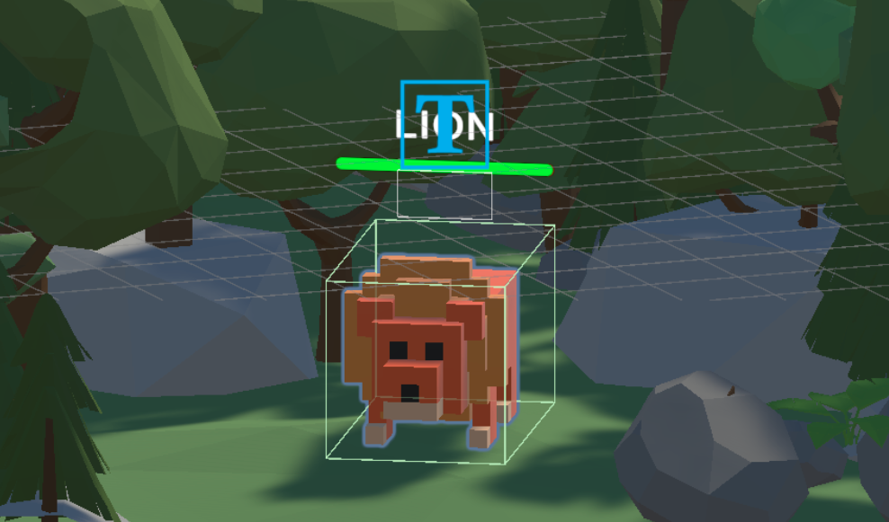
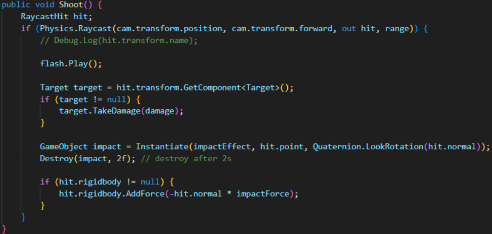

# Chicken-Hunter-In-Forest
Unity Version: 2022.3.26f1

## Gameplay
The player can use the WASD to control the chicken’s movement, and use SPACE to jump. Moreover, the player has to use MOUSE to rotate the view and CLICK to shoot the lions.

## Game Mechanism
The game will end whenever the player presses the esc button. Other than that, when the player successfully defeats all enemies in the game, a RESTART button will appear. And the player can restart the game by clicking the button.

  
  

## InputSystem Settings and Scripts
<b>Input Actions:</b>
define the player movement, jumping, and shooting actions.

<b>InputManager.cs: </b>
set input actions and classes and update player position and view direction according to the inputs.

  
  

<b>PlayerMotor.cs:</b>
handle logics for moving and jumping.

  
  

<b>PlayerLook.cs:</b>
handle logics for calculating the looking direction.

  
  

## Prefab Settings
I created prefabs for constructing the forest maze. There are two rows and 3 columns of objects.

The aerial view of the forest maze.

## Enemy (Lion) Information
There are a label and a bloodbox which displays the HP above each enemy. That information will always be facing the player.

## Shooting
I use two particle systems to implement the shooting effect, one is put in front of the croissant while the other is displayed at the hit surface.

  
  

To implement the latter one, I utilize the “Instantiate()” to create the effect and set it to destroy after 2 seconds to prevent from generating too many objects.

## Asset Store Packages
1. Low-Poly Simple Nature Pack - JustCreate

2. 5 animated Voxel animals - VoxelGuy

3. FREE Casual Food Pack- Mobile/VR - Lumo-Art 3D

4. Particle Pack - Unity Technologies
